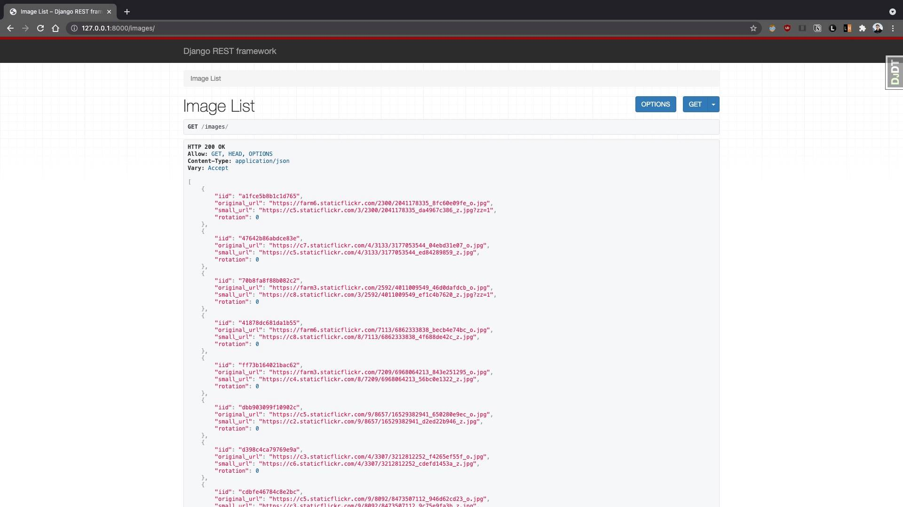
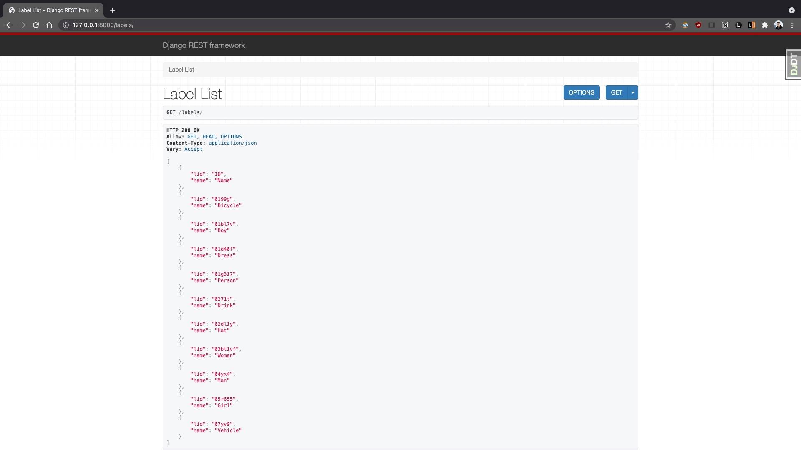

# label.ai

## How to Load the Database
### Generating the test data
Navigate to the `dataset_preprocessing` directory
Get modules `python -m pip install -r requirements.txt`

Download CSV files: `python download_csv.py`

Filter the CSV files: `python filter_csv.py`

Generate the test dataset: `python generate_test_dataset.py`

### Populating the Database
1. From the terminal in the `test_dataset_hardcoded` directory run `psql`
2. Connect to the right database by running `\c label_ai`
3. Run `\copy Image FROM 'images.csv' DELIMITER ',' CSV;`
4. Run `\copy Label FROM 'labels.csv' DELIMITER ',' CSV;`
5. Run `\copy Classification(iid, lid, confidence, true_count, false_count, pre_classified) FROM 'classifications.csv' DELIMITER ',' CSV;`

## Files with SQL Code
Under `queries\` directory

## Current Features
To see these results, visit 0.0.0.0:8000

### List all image URLs (0.0.0.0:8000/images/)

### List all labels (0.0.0.0:8000/labels/)

## Code for Downloading and Transforming Data for Task 5 and 7
The code for downloading and cleaning the data for tasks 5 and 7 can be found in the `dataset_preprocessing` directory.
